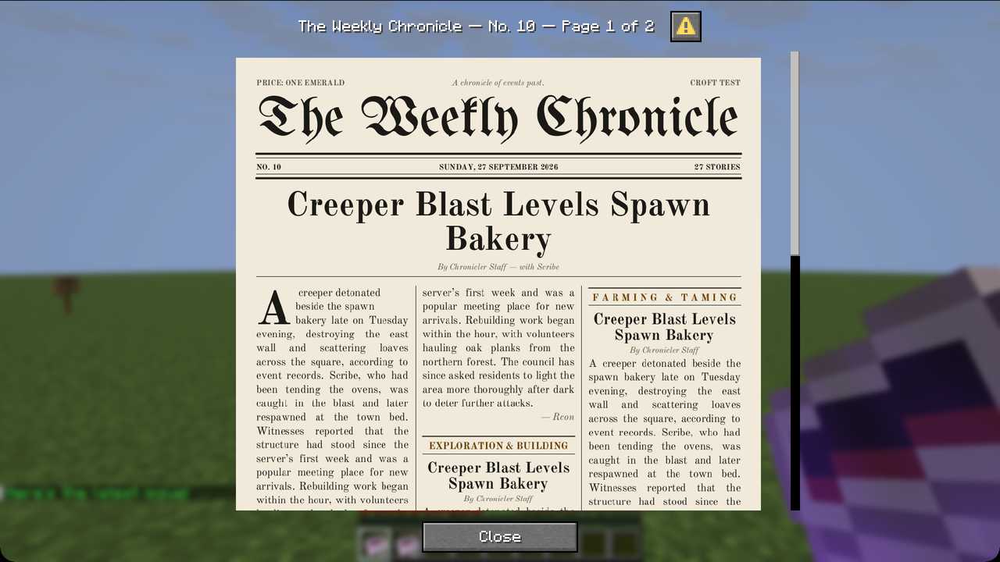
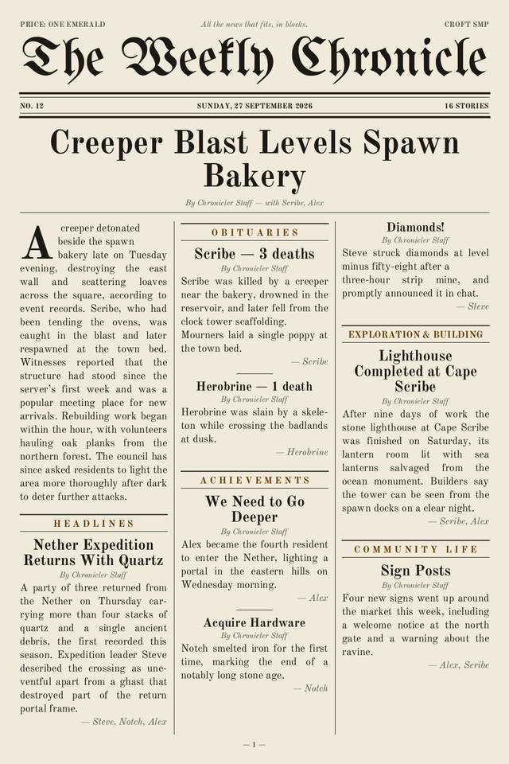

# Chronicler

A PaperMC plugin that tracks server events and generates a dynamic in-game newspaper delivered as a written book.

## Features

- **Death & PvP Tracking** — Records deaths, PvP kills, and mob kills with causes
- **Advancement Tracking** — Captures every advancement earned by players
- **Building & Exploration** — Tracks blocks placed/broken (non-natural), biome discoveries, ore discoveries, distance milestones
- **Social & Messaging** — Join/leave events, private message tracking (/msg, /tell, /w)
- **Session Tracking** — Cumulative playtime, session counts, daily login streaks with milestones
- **Economy Tracking** — Detects Vault at runtime, records transactions in newspaper
- **Breaking News** — Special coverage when players first enter The End
- **Dynamic Newspaper** — Generates a structured book with sections: Headlines, Breaking News, Obituaries, Achievements, Hunting Grounds, Exploration & Building, Economy & Trading, Social, Statistics
- **LLM Integration** — Optional AI-powered article generation via Ollama, OpenAI-compatible APIs (OpenRouter, OpenAI), or Anthropic Claude; falls back to template summaries
- **Web View** — Optional embedded HTTP server serves a styled HTML version of each issue with dark/light theme toggle and RSS feed
- **Editorial Workflow** — Create, preview, edit, remove stories from, and approve persistent draft issues
- **Newspaper Layout** — Ranked articles with configurable bylines, tone, section order, colours, and clean continuation pages
- **Privacy Controls** — Exclude players and redact private messages, chat excerpts, and coordinates; with chat excerpts off, chat text is never stored at all
- **Archive & Search** — Retention policies, import/export, web issue navigation, permalinks, and full-text search
- **Safe Updates** — Automatic GitHub release updates with mandatory SHA-256 verification
- **PlaceholderAPI** — 13+ placeholders exposing issue stats, player playtime, login streaks
- **Archived Issues** — Every issue is saved to disk and browsable via `/chronicler archive`
- **Headline Ticker** — Periodic action-bar broadcasts of random headlines from the latest issue
- **Issue #0** — On first run, server logs (`logs/latest.log` and rotated `*.log.gz`) are parsed to backfill historical events (joins, deaths, advancements, chat) into issue #0
- **Auto-Delivery** — Each new issue spawns directly into every online player's inventory (drops at feet if full); players can opt out with `/chronicler subscribe`
- **Locale Support** — All messages customizable via `messages.yml` (MiniMessage format)
- **bStats Metrics** — Anonymous usage statistics (configurable)
- **Paper Plugin Support** — Includes `paper-plugin.yml` with soft dependency declarations for PlaceholderAPI and Vault
- **Update Checker** — Checks GitHub for newer releases on startup

## The In-Game Newspaper



Each issue is typeset as broadsheet pages (blackletter masthead, dateline, lead story with drop cap, justified columns, section bands and a statistics box) and shown in a reader screen when a player right-clicks their newspaper or runs `/chronicler read`.

How it works:

- Chronicler builds a small resource pack for the latest issue (about 250 KB per page) and serves it from the embedded web server. Players are offered it on join and after each new issue; it only ever replaces Chronicler's own pack.
- Pages are drawn as bitmap-font glyphs inside a dialog, so no client mod is needed. The pack also gives newspapers their own item texture.
- Players who decline the pack get a **text edition** with section-by-section navigation, and the item is still a normal written book, laid out to fit book pages exactly.
- Old papers printed by earlier versions open in the reader too.

Set `reader.resource-pack.public-url` to the address players reach your web server on (for example `http://play.example.com:8080`). If it is blank, `server-ip` is used; if that is blank too, the pack is written to `plugins/Chronicler/web/chronicler-pack.zip` for you to host or merge into your own server pack. Set `reader.mode: book` to keep the classic written book only.



Fonts: [UnifrakturMaguntia](https://github.com/google/fonts/tree/main/ofl/unifrakturmaguntia) and [Old Standard TT](https://github.com/google/fonts/tree/main/ofl/oldstandardtt), both under the SIL Open Font License (included in `src/main/resources/fonts/`).

## Requirements

- **Server:** A supported Paper build on the current API line
- **Java:** 26+
- **Optional:** [PlaceholderAPI](https://www.spigotmc.org/resources/placeholderapi.6245/) for placeholder expansion
- **Optional:** [Vault](https://www.spigotmc.org/resources/vault.34315/) for economy tracking
- **Optional:** Ollama, OpenAI, OpenRouter, or Anthropic API key for LLM articles

## Installation

1. Download the latest release jar from the [releases page](https://github.com/ewanc26/Chronicler/releases)
2. Place the jar in your server's `plugins/` folder
3. Restart the server
4. Edit `plugins/Chronicler/config.yml` to your liking
5. Run `/chronicler reload` to apply changes

## Configuration

`plugins/Chronicler/config.yml`:

```yaml
# Master toggle
enabled: true

# Publication schedule: DAILY, WEEKLY, BIWEEKLY, MONTHLY, or ticks
schedule: WEEKLY
# Time base: REAL_TIME (default) or IN_GAME
schedule-base: REAL_TIME
publish-day: 0        # 0=Monday, 6=Sunday
publish-hour: 8       # Hour in 0-23

# Event tracking toggles
tracking:
  deaths: true
  kills: true
  pvp: true
  advancements: true
  blocks: true
  exploration: true
  social: true
  economy: true

# Maximum stored events before pruning
event-limit: 500

# bStats metrics
bstats-enabled: true

# LLM article generation (set enabled: false for template-only mode)
llm:
  enabled: true
  provider: ollama    # ollama, openai, anthropic, lmstudio, cocore
  model: llama3.2
  api-key: ""
  base-url: https://openrouter.ai/api/v1
  ollama-url: http://localhost:11434
  timeout-seconds: 30
  # {series_title} comes from newspaper.title; {server_name} from newspaper.server-name
  system-prompt: "You are the editor of \"{series_title}\"..."

newspaper:
  title: "The Weekly Chronicle"
  server-name: ""     # blank = "this server"
```

The LLM is probed asynchronously at startup and again before each issue, so a model server started after Minecraft is picked up automatically; while it is unreachable, issues use template copy.

## Commands

| Command | Permission | Description |
|---|---|---|
| `/chronicler read` | `chronicler.use` | Receive and open the latest issue |
| `/chronicler read <player>` | `chronicler.admin` | Hand a player the latest issue and open it for them |
| `/chronicler web` | `chronicler.use` | Show the web view URL |
| `/chronicler status` | `chronicler.admin` | Show plugin status |
| `/chronicler stats <player>` | `chronicler.use` | View a player's tracked stats |
| `/chronicler subscribe` | `chronicler.use` | Toggle auto-delivery on/off |
| `/chronicler archive list` | `chronicler.use` | List past issues |
| `/chronicler archive read <#>` | `chronicler.admin` | Receive an old issue as a book |
| `/chronicler archive export <#>` | `chronicler.admin` | Export an archived issue as JSON |
| `/chronicler archive import <file>` | `chronicler.admin` | Import JSON from the plugin imports folder |
| `/chronicler editor create` | `chronicler.admin` | Generate a persistent draft issue |
| `/chronicler editor preview` | `chronicler.admin` | List indexed draft stories |
| `/chronicler editor edit <section> <story> headline\|body <text>` | `chronicler.admin` | Edit draft copy |
| `/chronicler editor remove <section> <story>` | `chronicler.admin` | Remove a draft story |
| `/chronicler editor publish` | `chronicler.admin` | Approve and publish the draft |
| `/chronicler diagnostics` | `chronicler.admin` | Show subsystem and updater health |
| `/chronicler reload` | `chronicler.admin` | Reload configuration and restart all subsystems |
| `/chronicler publish` | `chronicler.admin` | Force-publish a new issue now |

Alias: `/clr`

## Placeholders (PlaceholderAPI)

| Placeholder | Description |
|---|---|
| `%chronicler_issue%` | Current issue number |
| `%chronicler_events%` | Events stored in buffer |
| `%chronicler_schedule%` | Publication schedule |
| `%chronicler_llm%` | LLM status (online/offline) |
| `%chronicler_web%` | Web status (enabled/disabled) |
| `%chronicler_last_publish%` | Last publish date |
| `%chronicler_players%` | Unique players in latest issue |
| `%chronicler_deaths%` | Death stories in latest issue |
| `%chronicler_kills%` | Kill stories in latest issue |
| `%chronicler_advancements%` | Advancement stories in latest issue |
| `%chronicler_playtime%` | Player's total playtime (Xh Ym) |
| `%chronicler_streak%` | Player's current login streak (days) |
| `%chronicler_sessions%` | Player's total session count |

## Permissions

| Permission | Default | Description |
|---|---|---|
| `chronicler.use` | `true` | Use basic commands |
| `chronicler.admin` | `op` | Reload, publish, archive read |

## Building from Source

```bash
git clone https://github.com/ewanc26/Chronicler.git
cd Chronicler
./gradlew build
```

The compiled jar will be in `build/libs/` with the current release name.

## Testing

```bash
./gradlew test
```

## Data Files

- `plugins/Chronicler/events.json` — Event buffer (JSON, kotlinx-serialization)
- `plugins/Chronicler/sessions.json` — Per-player session data
- `plugins/Chronicler/subscriptions.json` — Per-player subscription preferences
- `plugins/Chronicler/publish-state.json` — Last publish time and issue number
- `plugins/Chronicler/archive/issue-*.json` — Archived issues
- `plugins/Chronicler/messages.yml` — Localized message strings (MiniMessage)

## Support

If you find this project useful, consider supporting its development:

[](https://ko-fi.com/ewancroft)
[](https://github.com/sponsors/ewanc26)

## License

AGPL-3.0. See [LICENSE](LICENSE).
